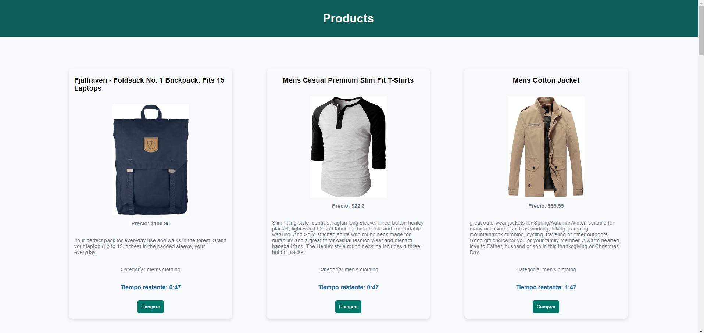

# Make It Real - Assessment 1

This is a solution to the Aplicación Web con JavaScript Vanilla  project of the Make It Real course.

## Table of contents

- [Overview](#overview)
  - [The challenge](#the-challenge)
  - [Screenshot](#screenshot)
- [My process](#my-process)
  - [Built with](#built-with)
  - [What I learned](#what-i-learned)
  - [Continued development](#continued-development)
  - [Useful resources](#useful-resources)
- [Author](#author)
- [Acknowledgments](#acknowledgments)


## Overview

### The challenge

Users should be able to:

- JSS VANILLA
- FHTML
- CSS

### Screenshot
COMPROBACION



## My process

### Built with

- HTML5
- CSS c
- Flexbox
- JS VANILLA

### What I learned

Use this section to recap over some of your major learnings while working through this project. Writing these out and providing code samples of areas you want to highlight is a great way to reinforce your own knowledge.

To see how you can add code snippets, see below:

```JS
products.forEach((product) => {
      const productCard = document.createElement('div');
      productCard.classList.add('product-card');

```
### Continued development


## Author

- GITHUB - [@JohanPinares](https://github.com/JohanEmersonPinares)
- linkedin - [@JohanPinares](https://www.linkedin.com/in/johan-emerson-pinares/)


## Acknowledgments

